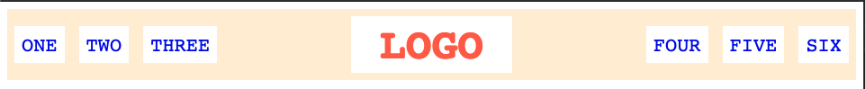

# A Basic Header

Use flexbox rules to create this very common webpage header style. The benefit to using flex here is that everything should be _flexible_. Check out the two screenshots below to get an idea of how it should scale with your screen. Besides flex rules, you'll also want to add some rules for margin and padding. (Hint: `ul`s have some default margin/padding that you will need to deal with.)

## Desired Outcome

narrow:

wide: 

### Self Check
- There is space between all items and the edge of the header (specific px amount doesn't matter here).
  - Yes. I added a "gap" between the "ul" items (10px)
- Logo is centered vertically and horizontally.
  - Yes. Justify-content set to "space-between" and Align-items set to "center"
- list-items are horizontal, and are centered vertically inside the header.
  - Yes. It took me some time to get to a solution. To get the to be horizontal I had to add the "flex" property to them. I originally thought I'd have to deal with "links-left" and "links-right" independently.
- left-links and right-links are pushed all the way to the left and right, and stay at the edge of the header when the page is resized.
  - Yes. Justify-contents set to "space-between", margin and padding set to 0
- Your solution does not use floats, inline-block, or absolute positioning.
  - Nope. Although I thought I would have to set the ul elements to "inline", but flex already gave me what was needed